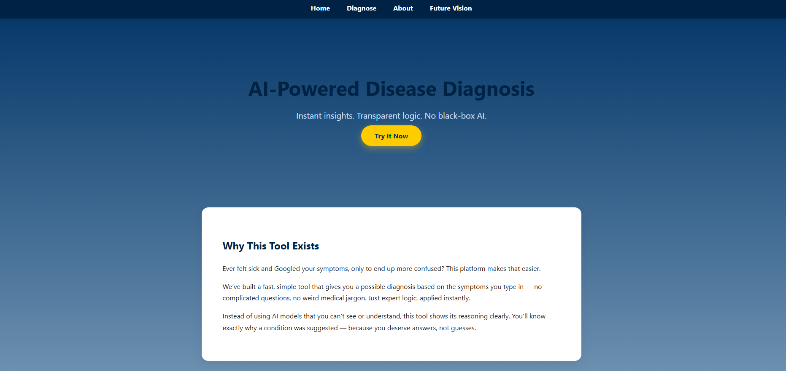
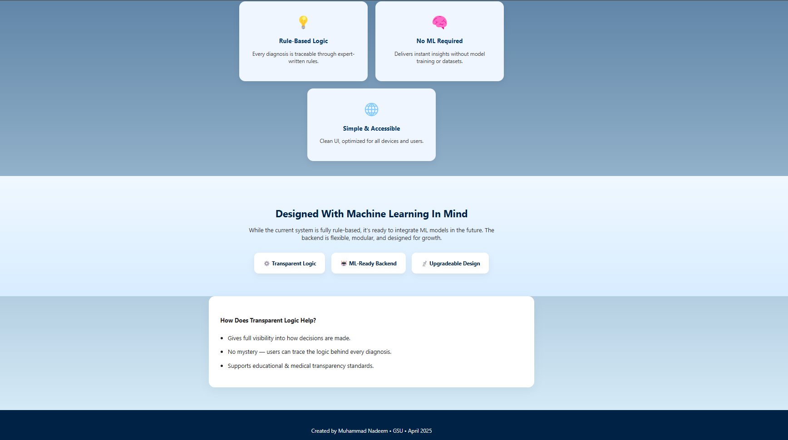
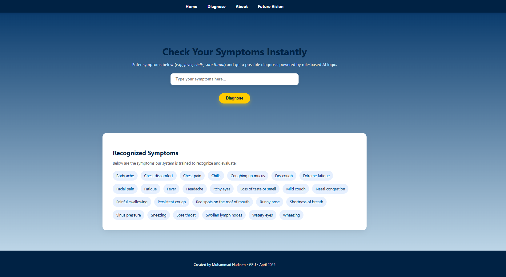
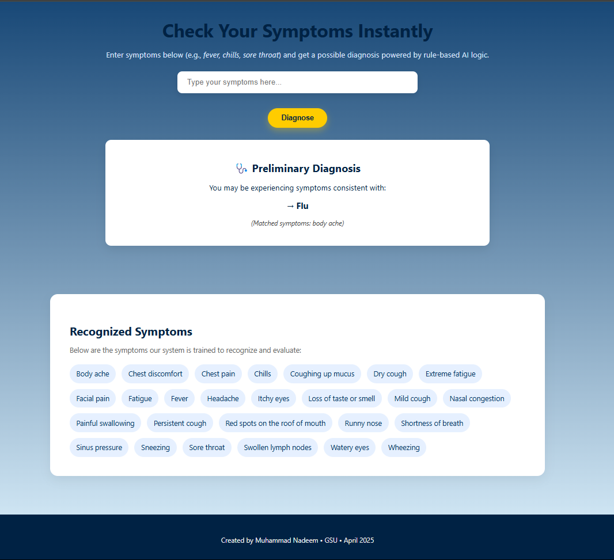
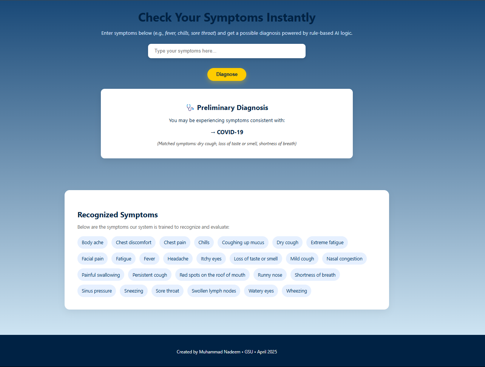
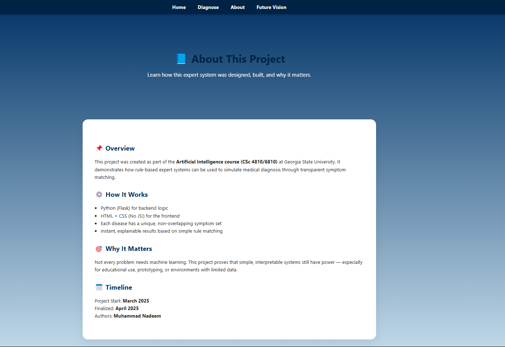
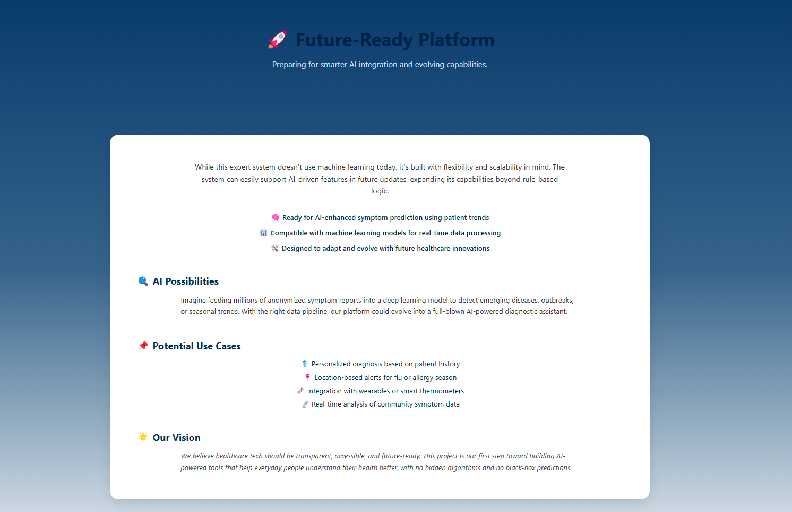

# 🧠 AI-Project-Diagnosis-System

Welcome to the **AI-Project-Diagnosis-System** – a simple, lightweight web application that simulates an expert system for diagnosing diseases based on symptoms.

This project was developed to demonstrate how rule-based AI can be applied to healthcare diagnosis using clear symptom-disease mappings **without complex machine learning**.

---

## 🧠 How It Works

| Step | Description |
|------|-------------|
| 1️⃣ | The system uses a **rule-based approach** (no ML training required) |
| 2️⃣ | Users input their symptoms through a **clean web interface** |
| 3️⃣ | Based on **unique symptoms provided**, the system suggests a **possible diagnosis** |
| 4️⃣ | Each disease has a **distinct set of symptoms** to avoid overlap and ensure clarity |

---

## ⚙️ Technologies Used

| Type         | Tools & Purpose                       |
|--------------|----------------------------------------|
| Backend      | **Python (Flask)** – server and routing |
| Frontend     | **HTML/CSS** – structure and styling   |
| Interactivity| **JavaScript** – symptom interaction   |
| Styling      | **Bootstrap** – responsive UI          |
| AI Logic     | **Rule-based logic** – symptom-disease mapping |

---

## 📂 Project Structure

```
AI-Project-Diagnosis-System/
│
├── app.py                  # Main Flask application
├── templates/
│   └── index.html          # Main webpage layout
├── static/
│   ├── style.css           # Custom styles
│   └── script.js           # JavaScript functionality
├── requirements.txt        # Python package dependencies
├── screenshots/
│   ├── about-section.png
│   ├── diagnose.png
│   ├── future.png
│   ├── homepage1.png
│   ├── homepage2.png
│   ├── output1.png
│   └── output2.png
├── User_Manual.pdf         # Instructions for users
├── IEEE_Paper.pdf          # Project research paper (IEEE format)
├── Presentation_Slides.pptx # Final project presentation
└── README.md               # This file
```

---

## 📸 Screenshots

| Section             | Preview |
|---------------------|---------|
| **Homepage 1**      |  |
| **Homepage 2**      |  |
| **Diagnose Page**   |  |
| **Output Example 1**|  |
| **Output Example 2**|  |
| **About Section**   |  |
| **Future Goals**    |  |

> Screenshots are located in the `/screenshots` folder and must be committed to GitHub to render properly.

---

## 🖥️ How to Run Locally

```bash
# Clone this repository
git clone https://github.com/Harris1250/AI-Project-Diagnosis-System.git
cd AI-Project-Diagnosis-System

# Install dependencies
pip install -r requirements.txt

# Run the app
python app.py
```

Then open your browser and go to:  
👉 `http://127.0.0.1:5000`

✅ Fully functional local app  
✅ No database or login required  
✅ Lightweight & responsive

---

## 💡 Example Diseases Covered

| Disease         | Example Symptoms                        |
|-----------------|------------------------------------------|
| **Flu**         | Fever, Body Ache, Fatigue, Chills, Sore Throat |
| **Common Cold** | Runny Nose, Sneezing, Sore Throat, Mild Cough |
| **COVID-19**    | Loss of Taste/Smell, Dry Cough, Shortness of Breath |
| **Sinus Infection** | Sinus Pressure, Headache, Facial Pain, Nasal Congestion |
| **Pneumonia**   | Chest Pain, Coughing Up Mucus, Shortness of Breath |
| **Allergies**   | Itchy Eyes, Sneezing, Nasal Congestion, Watery Eyes |
| **Bronchitis**  | Persistent Cough, Wheezing, Chest Discomfort |
| **Strep Throat**| Swollen Lymph Nodes, Painful Swallowing, Red Spots |
| **Mononucleosis** | Sore Throat, Swollen Lymph Nodes, Extreme Fatigue |

---

## 📄 Additional Resources

| Resource               | Description                                 |
|------------------------|---------------------------------------------|
| 📖 **User Manual**     | Learn how to use the system effectively     |
| 📚 **IEEE Paper**      | In-depth technical documentation            |
| 🎥 **Presentation Slides** | Quick overview of the system's design and functionality |

---

## 📬 Contact

If you have questions or feedback, feel free to reach out!

| Platform | Info |
|----------|------|
| 👨‍💻 GitHub   | [Harris1250](https://github.com/Harris1250) |

---

🚀 *Try it yourself and explore the power of simple AI diagnosis!*
